# Lavanya Service — Expanded Design

> Based on full audit of `lavanya_service` app as of June 2026.

## Business Model (Reaffirmed)

Lavanya eMart is a **retailer intermediary** — sells home appliances, brands
provide warranty/service. Lavanya follows up, earns margin on product sale.
**Lavanya does NOT repair products.** All service roads lead back to the brand
authorized service center or a local technician for out-of-warranty cases.

---

## 1. Expanded Entity-Relationship Diagram

```mermaid
erDiagram
    %% ========== EXISTING (Core) ==========
    HD_Ticket {
        string ticket_type          "7 types: Service, Exchange, Demo, Return, Stock, Store Service, General"
        string status               "10 statuses: New→In Progress→Resolved→Closed"
        string service_flow_type    "11 flows: in_warranty, out_of_warranty_local, demo_installation, stock_supplier, return_service, store_service, replacement_approved_new, etc"
        string current_service_stage "33 stages"
        string next_action           "27 next actions with role gates"
        string escalation_level      "None, Level-1, Level-2, Level-3"
        string brand                 "Link→Brand Service Master"
        string product_category      "Link→Lavanya Product Category"
        string product_item          "Link→Lavanya Product Item"
        string product_type          "Select: AC, Refrigerator, Washing Machine, etc"
        string brand_ticket_number   "Brand's complaint reference"
        string service_path          "brand_warranty, brand_denied_local, out_of_warranty_local, customer_paid_local, lavanya_paid_goodwill, demo_installation, stock_supplier"
        string followup_stage        "registration_done, technician_call_pending, part_pending, etc"
        string closure_type          "Resolved, Closed-No-Response, Parts Not Available, Customer Withdrew, etc"
        int    escalated             "Boolean: has been escalated?"
        string vendor_cancellation_reference
        string financial_effect      "Nullable: ERP link for replacement/credit note"
    }

    Brand_Service_Master {
        string brand_name           "e.g., LG, Samsung, Whirlpool"
        string brand_contact
        string service_helpline
        string brand_region
        float  avg_resolution_days   "Computed: rolling 90-day average"
        float  escalation_rate       "Computed: % of tickets escalated"
        string service_network_type  "Own, Authorized 3P, Mixed"
        int    payment_block_days    "Days delay threshold before payment block"
        int    payment_blocked       "Boolean: is supplier payment currently blocked?"
    }

    Service_Center_Master {
        string center_name
        string brand                "Link→Brand Service Master"
        string area                 "Service area / zone"
        string city
        string contact_person
        string phone
        float  rating               "1-5"
        int    active_tickets
    }

    Local_Technician_Master {
        string technician_name
        string phone
        string area                 "Service area / zone"
        string specialization       "Product types they handle"
        float  rating               "1-5"
    }

    Service_Product_Receipt {
        string receipt_number
        string ticket               "Link→HD Ticket"
        string receipt_type         "Customer Handover, Part Collection, Replacement Unit Handover"
        date   receipt_date
        string product_condition    "Describes physical condition at intake"
        string item_status          "With Technician, With Brand SC, In Store, Returned to Customer"
        string custody_log           "JSON array of Custody Log Entry"
    }

    Lavanya_Customer_Profile {
        string customer_name
        string primary_mobile       "Unique, indexed, normalized"
        string alternate_mobile
        string address
        string pincode
        string last_ticket          "Link→HD Ticket"
        int    ticket_count
        string last_product_type
        string last_brand
    }

    Lavanya_Product_Category {
        string category_name        "Unique, e.g., AC, Refrigerator, Washing Machine"
        string parent_category      "Self-link"
    }

    Lavanya_Product_Item {
        string item_name            "Unique, e.g., LG 1.5 Ton Dual Inverter Split AC"
        string item_type            "Link→Lavanya Product Category"
        string brand                "Link→Brand Service Master"
        string model_no
        int    default_warranty_months
    }

    %% ========== PROPOSED NEW ==========

    Supplier_Performance_Log {
        string brand                "Link→Brand Service Master"
        string service_center       "Link→Service Center Master"
        int    total_tickets        "Period total"
        int    resolved_on_time
        int    escalated_tickets
        float  avg_resolution_hours
        date   period_start
        date   period_end
        string period_type          "Monthly, Quarterly"
    }

    Area_Performance_Log {
        string area                 "Zone / pincode range / city area"
        string brand                "Optional: per-brand breakdown"
        int    total_tickets
        float  avg_resolution_hours
        float  customer_satisfaction_rate
        date   period_start
        date   period_end
    }

    Supplier_Payment_Block {
        string brand                "Link→Brand Service Master"
        string service_center       "Link→Service Center Master"
        string block_status         "Active, Released, Pending Review"
        date   blocked_at
        date   released_at
        int    overdue_ticket_count "Tickets exceeding SLA threshold"
        float  max_delay_days       "Maximum delay among current tickets"
        string blocked_by           "Link→User"
        string block_reason
        string release_note
    }

    Return_Service_Record {
        string ticket               "Link→HD Ticket"
        string return_type          "Under Warranty, Out of Warranty, Customer Damage"
        string return_reason
        string brand_decision       "Repair, Replace, Credit Note, Reject"
        date   brand_decision_date
        string lavanya_action       "Replacement Dispatched, Refund Processed, Credit Note Applied"
        date   resolution_date
        float  customer_credit_amount
        string financial_effect     "Link to ERP credit note / stock entry"
    }

    Demo_Installation_Record {
        string ticket               "Link→HD Ticket"
        string job_type             "Demo Only, Installation Only, Demo + Installation"
        date   scheduled_date
        string assigned_technician  "Link→Local Technician Master"
        string status               "Scheduled, In Progress, Completed, Cancelled"
        date   completion_date
        string customer_feedback
    }

    Stock_Complaint_Record {
        string ticket               "Link→HD Ticket"
        string complaint_type       "Damaged in Transit, Manufacturing Defect, Wrong Item, Shortage"
        string supplier             "Link→Brand Service Master or supplier"
        string supplier_lr_number   "LR/Bill number"
        date   complaint_raised_to_supplier
        string supplier_response    "Accepted, Rejected, Replacement Dispatched, Pending"
        date   response_date
        string resolution           "Replacement Received, Credit Note, Adjusted in Next Bill"
    }

    Store_Service_Record {
        string ticket               "Link→HD Ticket"
        string product_condition_at_receipt "Visual condition notes"
        string storage_location     "Store rack / area"
        string service_type         "Demo for customer, Diagnostic, Repair by brand SC pickup"
        date   received_at_store
        date   handed_to_brand_sc
        date   returned_from_brand_sc
        date   handed_back_to_customer
        string current_location     "With Store, With Brand SC, With Customer"
    }

    Replacement_Record {
        string ticket               "Link→HD Ticket"
        string replacement_type     "Approved by Brand, Goodwill by Lavanya, Insurance Claim"
        string old_product_item     "Link→Lavanya Product Item"
        string old_serial_no
        string new_product_item     "Link→Lavanya Product Item"
        string new_serial_no
        string new_invoice_ref      "New sale invoice for replacement unit"
        string old_return_ref       "Return/stock entry for defective unit"
        string brand_approval_ref   "Brand's replacement approval reference"
        date   replacement_date
        string financial_effect     "Credit note from brand, or Lavanya cost"
    }

    Supplier_SLA_Definition {
        string brand                "Link→Brand Service Master"
        string service_center       "Link→Service Center Master (optional)"
        int    response_sla_hours
        int    resolution_sla_hours
        int    payment_block_delay_days  "Days overdue before payment block triggers"
        string payment_terms        "Net 30, Net 45, etc"
        float  penalty_percent      "Penalty % per day of delay"
        int    enabled              "Boolean"
    }

    Customer_Communication_Log {
        string ticket               "Link→HD Ticket"
        string channel              "WhatsApp, SMS, Phone Call, Email"
        string direction            "Outbound, Inbound"
        string template_used        "Optional template identifier"
        string message_body
        string status               "Sent, Delivered, Failed, Read"
        date   sent_at
        string sent_by              "Link→User or 'System'"
    }

    %% ========== RELATIONSHIPS ==========

    Brand_Service_Master ||--o{ Service_Center_Master : "has"
    Brand_Service_Master ||--o{ Supplier_Performance_Log : "tracked by"
    Brand_Service_Master ||--o{ Supplier_Payment_Block : "may be blocked"
    Brand_Service_Master ||--o{ Supplier_SLA_Definition : "defines SLA"
    Brand_Service_Master ||--o{ Lavanya_Product_Item : "catalog"

    Service_Center_Master ||--o{ Supplier_Performance_Log : "performs"
    Service_Center_Master ||--o{ Supplier_Payment_Block : "may be blocked"

    HD_Ticket ||--o{ Service_Product_Receipt : "has"
    HD_Ticket ||--o{ Return_Service_Record : "may have"
    HD_Ticket ||--o{ Demo_Installation_Record : "may have"
    HD_Ticket ||--o{ Stock_Complaint_Record : "may have"
    HD_Ticket ||--o{ Store_Service_Record : "may have"
    HD_Ticket ||--o{ Replacement_Record : "may have"
    HD_Ticket ||--o{ Customer_Communication_Log : "has many"
    HD_Ticket ||--|{ Lavanya_Customer_Profile : "linked to customer"
```



---

## 2. New Entity Definitions

### 2.1 Supplier Performance Log
**DocType:** `Supplier Performance Log`

| Field | Type | Purpose |
|-------|------|---------|
| brand | Link → Brand Service Master | Which brand |
| service_center | Link → Service Center Master (optional) | Specific center or all |
| period_start | Date | Start of period |
| period_end | Date | End of period |
| total_tickets | Int (Computed) | Tickets in period for this brand |
| resolved_on_time | Int (Computed) | Tickets resolved within SLA |
| escalated_tickets | Int (Computed) | Tickets that reached escalation |
| avg_resolution_hours | Float (Computed) | Average hours from registration to closure |
| avg_response_hours | Float (Computed) | Average hours from registration to 1st SC action |
| customer_satisfied_count | Int (Computed) | Customer satisfaction = Satisfied |
| customer_unsatisfied_count | Int (Computed) | Customer satisfaction = Not Satisfied |

**Frequency:** Generated by daily scheduler job (rolls up previous day).

### 2.2 Area Performance Log
**DocType:** `Area Performance Log`

| Field | Type | Purpose |
|-------|------|---------|
| area | Data (pincode range / zone name) | Service coverage zone |
| brand | Link → Brand Service Master (optional) | Per-brand breakdown |
| period_start | Date | Start of period |
| period_end | Date | End of period |
| total_tickets | Int (Computed) | |
| avg_resolution_hours | Float (Computed) | |
| avg_response_hours | Float (Computed) | |
| customer_satisfaction_rate | Float (Computed) | % of closed tickets with satisfied |
| top_service_center | Data | Most-used SC in this area |
| top_technician | Data | Most-used local tech in this area |

### 2.3 Supplier Payment Block
**DocType:** `Supplier Payment Block`

| Field | Type | Purpose |
|-------|------|---------|
| brand | Link → Brand Service Master | Target brand |
| service_center | Link → Service Center Master (optional) | Specific center scope |
| block_status | Select: Active, Released, Pending Review | Current state |
| blocked_at | Datetime | When block was applied |
| released_at | Datetime (optional) | When released |
| blocked_by | Link → User | Who triggered/applied |
| block_reason | Small Text | Why blocked (e.g., "Avg 12d delay, 8 tickets > 7d SLA") |
| release_reason | Small Text | Why released |
| overdue_ticket_count | Int (Computed) | Number of active tickets exceeding SLA |
| max_delay_days | Float (Computed) | Worst current delay in days |
| release_note | Small Text | Optional notes on resolution |

**Trigger:** Scheduler checks daily: if any active tickets for a brand exceed
`payment_block_delay_days` (from `Supplier SLA Definition`), auto-create a
`Supplier Payment Block` with status `Pending Review`. A manager reviews and
sets to `Active` or discards.

### 2.4 Return Service Record
**DocType:** `Return Service Record`

| Field | Type | Purpose |
|-------|------|---------|
| ticket | Link → HD Ticket | Origin |
| return_type | Select: Under Warranty, Out of Warranty, Customer Damage, Wrong Product |
| return_reason | Small Text | |
| brand_decision | Select: Repair, Replace, Credit Note, Reject | Decision from brand |
| brand_decision_date | Date | |
| lavanya_action | Select: Replacement Dispatched, Refund Processed, Credit Note Applied, Awaiting Brand |
| resolution_date | Date | |
| customer_credit_amount | Currency | Amount credited to customer |
| financial_effect | Data | ERP / credit note reference |
| brand_reimbursement_expected | Currency | Amount expected from brand |
| brand_reimbursement_received | Currency | Amount actually received |
| reimbursement_status | Select: Pending, Partial, Received, Not Applicable |

### 2.5 Demo / Installation Record
**DocType:** `Demo Installation Record`

| Field | Type | Purpose |
|-------|------|---------|
| ticket | Link → HD Ticket | |
| job_type | Select: Demo Only, Installation Only, Demo + Installation |
| scheduled_date | Date | |
| assigned_technician | Link → Local Technician Master |
| status | Select: Scheduled, In Progress, Completed, Cancelled |
| completion_date | Date |
| customer_feedback | Small Text |
| feedback_status | Select: Pending, Satisfied, Not Satisfied |
| technician_charges | Currency | |
| charged_to_customer | Currency | |

### 2.6 Stock Complaint Record
**DocType:** `Stock Complaint Record`

| Field | Type | Purpose |
|-------|------|---------|
| ticket | Link → HD Ticket | |
| complaint_type | Select: Damaged in Transit, Manufacturing Defect, Wrong Item, Shortage, Other |
| supplier | Link → Brand Service Master or generic Supplier |
| supplier_invoice_ref | Data | LR/Bill/invoice number from supplier |
| complaint_raised_date | Date | |
| complaint_raised_to_supplier | Date | |
| supplier_response | Select: Accepted, Rejected, Replacement Dispatched, Credit Note Issued, Pending |
| response_date | Date | |
| resolution | Select: Replacement Received, Credit Note Received, Adjusted in Next Bill, Not Resolved |
| resolved_date | Date | |
| financial_impact | Currency | Cost if not recovered |

### 2.7 Store Service Record
**DocType:** `Store Service Record`

| Field | Type | Purpose |
|-------|------|---------|
| ticket | Link → HD Ticket | |
| product_received_at_store | Date | |
| product_condition_notes | Small Text | Visual at intake |
| storage_location | Data | Store rack/zone for tracking |
| service_type | Select: Customer Demo, Diagnostic Only, Hold for Brand SC Pickup, Repair by Local Tech |
| handed_to_brand_sc_date | Date | When brand SC picked up |
| brand_sc_reference | Data | |
| returned_from_brand_sc_date | Date | |
| handed_back_to_customer_date | Date | |
| current_location | Select: With Store, With Brand SC, With Customer, With Local Technician |
| days_in_store | Int (Computed) | |
| storage_charge_applicable | Check | |

### 2.8 Replacement Record
**DocType:** `Replacement Record`

| Field | Type | Purpose |
|-------|------|---------|
| ticket | Link → HD Ticket | |
| replacement_type | Select: Approved by Brand (Reimbursed), Goodwill by Lavanya, Insurance Claim |
| old_product_item | Link → Lavanya Product Item |
| old_serial_no | Data | |
| new_product_item | Link → Lavanya Product Item |
| new_serial_no | Data | |
| new_invoice_ref | Link → Sales Invoice (if ERPNext) | New sale |
| old_return_ref | Link → Stock Entry | Return of defective |
| brand_approval_ref | Data | Brand's replacement approval number |
| replacement_date | Date | |
| financial_effect | Data | Overall financial impact reference |
| lavanya_cost | Currency | Cost if Lavanya bears it |
| brand_reimbursement_expected | Currency | |
| brand_reimbursement_received | Currency | |

### 2.9 Supplier SLA Definition
**DocType:** `Supplier SLA Definition`

| Field | Type | Purpose |
|-------|------|---------|
| brand | Link → Brand Service Master | |
| service_center | Link → Service Center Master (optional) | |
| response_sla_hours | Int | Expected first-response time |
| resolution_sla_hours | Int | Expected resolution time |
| payment_block_delay_days | Int | Threshold for auto-payment-block |
| payment_terms | Select: Net 30, Net 45, Net 60, Advance |
| penalty_percent | Float | Daily penalty % for delay |
| applicable_product_types | Small Text | Optional filter |
| enabled | Check | |

### 2.10 Customer Communication Log
**DocType:** `Customer Communication Log`

| Field | Type | Purpose |
|-------|------|---------|
| ticket | Link → HD Ticket | |
| channel | Select: WhatsApp, SMS, Phone Call, Email |
| direction | Select: Outbound, Inbound |
| template_used | Data | Template name/ID |
| message_body | Text | |
| status | Select: Sent, Delivered, Failed, Read, Incoming |
| sent_at | Datetime | |
| delivered_at | Datetime | |
| read_at | Datetime | |
| sent_by | Link → User or "System" | |

---

## 3. Expanded Service Flows

### 3.1 Flow: Store Service (`store_service`)
*Customer brought product to store for service (not home pickup)*

**Stages:**
1. `product_received_at_store` → Product handed over at store counter, Store Service Record created
2. `brand_sc_notified` → Lavanya contacts brand SC to pick up from store
3. `brand_sc_picked_up` → Brand SC collected product
4. `brand_sc_diagnosis_pending` → Awaiting diagnosis from brand
5. `diagnosis_received` → Brand SC communicated the issue
6. `customer_informed_estimate` → Inform customer of findings (warranty/chargeable)
7. `customer_approved` → Customer approval obtained
8. `repair_completed_by_brand_sc` → Brand returns repaired product
9. `product_returned_to_store` → Product back at Lavanya store
10. `customer_notified_for_collection` → Customer called/msgd
11. `product_handed_over` → Customer collected, receipt signed
12. `closed` → Ticket closed

**New fields needed on HD Ticket:**
- `store_service_location` (Link → Store/Branch master)
- `product_received_via` (Select: Customer Walk-in, Store Pickup from Home)
- `storage_days` (Int, computed)

### 3.2 Flow: Stock Complaint (`stock_supplier`)
*Complaint about a product still in Lavanya's inventory (not yet sold)*

**Stages:**
1. `stock_issue_identified` → Issue found (damage, defect, wrong item)
2. `supplier_notified` → Supplier/brand informed
3. `supplier_acknowledged` → Supplier accepted complaint
4. `awaiting_supplier_response` → Waiting for replacement/credit
5. `replacement_received` → New unit received from supplier
6. `defective_returned_to_supplier` → Old unit sent back
7. `credit_note_received` → If supplier issued credit instead
8. `stock_updated` → Inventory updated in system
9. `closed` → Issue resolved

**Stock Complaint Record** is the primary record; HD Ticket tracks
communications.

### 3.3 Flow: Demo / Installation (`demo_installation`)
*Lavanya demonstrates product or performs installation for customer*

**Stages:**
1. `demo_installation_requested` → Customer requested
2. `technician_assigned` → Local tech assigned
3. `scheduled` → Date/time fixed
4. `demo_installation_in_progress` → Work happening
5. `product_demonstrated` → Demo completed
6. `installation_completed` → Installation done
7. `customer_feedback_pending` → Follow-up for satisfaction
8. `customer_satisfied` → Positive confirmation
9. `closed` → Ticket closed

**Demo Installation Record** tracks the job details.
**Service Charge Type** for this flow: if demo is free vs. chargeable
installation.

### 3.4 Flow: Replacement — Approved by Brand (`replacement_approved_new`)
*Brand approved replacement; Lavanya replaces product from own stock and claims
from brand*

**Stages:**
1. `replacement_approved_by_brand` → Brand gave replacement approval
2. `old_unit_collected` → Defective unit taken from customer (or store)
3. `new_unit_dispatched` → Lavanya sends replacement from stock
4. `new_unit_delivered` → Customer received
5. `old_unit_returned_to_brand` → Lavanya sends defective to brand
6. `brand_reimbursement_pending` → Awaiting brand payment
7. `reimbursement_received` → Brand reimbursed Lavanya
8. `replacement_record_completed` → All docs updated
9. `closed`

**Replacement Record** tracks both old and new units, financial effect.

**Financial effect:**
- If brand reimburses: Lavanya sells replacement at original price, brand pays
  Lavanya = revenue neutral + margin on original sale
- If goodwill (Lavanya bears): cost of new unit booked as expense

### 3.5 Flow: Return Service (`return_service`)
*Product returned by customer after delivery (change of mind, defect, wrong
product)*

**Stages:**
1. `return_requested` → Customer wants to return
2. `product_received` → Product back in Lavanya possession
3. `return_reason_verified` → Verified by Lavanya staff
4. `brand_notified_for_return` → If under warranty/defect, inform brand
5. `brand_return_decision` → Brand decides: repair, replace, reject
6. `customer_refund_processed` → If return accepted (change of mind policy)
7. `product_disposition` → Return to supplier, refurbish, or write-off
8. `closed`

**Return Service Record** captures the full lifecycle.

### 3.6 Payment Block Workflow

**Trigger:** Daily scheduler

1. For each active ticket, compute `days_since_last_update` for current stage
2. For each brand, check if any ticket exceeds `payment_block_delay_days`
   (from `Supplier SLA Definition`)
3. If yes and no existing `Active` block: create `Supplier Payment Block` in
   `Pending Review`
4. **Manager reviews** → can set to `Active` or discard
5. While `Active`:
   - Flag appears on brand/SC UI
   - Report shows "Payments on Hold"
   - Finance module (future ERPNext integration) checks this flag before
     processing payments
6. **Release condition:** Manager manually sets to `Released` when satisfied
   (e.g., brand resolves all overdue tickets)

**Reports needed:**
- `Supplier Payment Block Status` — shows all active/pending blocks
- `Brand Delay Summary` — shows avg delay per brand per month

---

## 4. Performance Tracking

### 4.1 Per-Brand Performance
Generated by scheduler (daily at midnight):

- **Total tickets** in period by brand
- **Avg resolution time** (complaint → brand acknowledged → resolved)
- **Escalation rate** — % of tickets reaching Level-1/Level-2/Level-3
- **Repeat complaint rate** — % of brand tickets that are repeated
- **Customer satisfaction** — % of closed tickets where satisfaction = Satisfied
- **Response SLA hit rate** — % of tickets where brand responded within SLA

**Source tables:** `HD Ticket` (brand, status, current_service_stage,
  escalation_level, is_repeated_complaint, customer_satisfaction_status)
→ aggregated in `Supplier Performance Log`.

### 4.2 Per-Service Center Performance
Same metrics as brand, but sliced by `Service Center Master`.

### 4.3 Per-Area Performance
Using `pincode` or a configurable `area` field on the ticket:

- **Tickets per area** — volume
- **Avg response time** by area
- **Most-used service centers** in each area
- **Most-used local technicians** in each area
- **Customer satisfaction** by area

Stored in `Area Performance Log`.

### 4.4 Per-Supplier (Brand) Dashboard
Proposed new API endpoint: `/api/method/lavanya_service.api.manager_reports.supplier_performance`

Returns:
- Rolling 90-day performance (avg resolution, escalation rate, ticket volume)
- Current payment block status
- Top 5 delayed tickets (with links)
- Comparison vs previous period

---

## 5. Existing HD Ticket Flow Type Changes

Add these new values to `stage_rules.SERVICE_FLOW_TYPES`:
```
store_service
stock_supplier          (exists but stages will be expanded)
demo_installation
replacement_approved_new
replacement_goodwill
return_service
```

Add these new values to `stage_rules.CURRENT_SERVICE_STAGES`:
```
# Store service
product_received_at_store
brand_sc_notified
brand_sc_picked_up
brand_sc_diagnosis_pending
diagnosis_received
product_returned_to_store
customer_notified_for_collection
product_handed_over

# Replacement
old_unit_collected
new_unit_dispatched
new_unit_delivered
old_unit_returned_to_brand
brand_reimbursement_pending
reimbursement_received

# Return
return_requested
return_reason_verified
brand_notified_for_return
brand_return_decision
customer_refund_processed
product_disposition

# Demo / Installation
technician_assigned
scheduled
demo_installation_in_progress
product_demonstrated
installation_completed
demo_customer_feedback_pending

# Stock complaint
stock_issue_identified
supplier_acknowledged
awaiting_supplier_response
defective_returned_to_supplier
credit_note_received
stock_updated
```

---

## 6. Existing DocType Modifications

### Add to HD Ticket custom fields:

| Fieldname | Type | Purpose |
|-----------|------|---------|
| `store_service_location` | Link → (new Store Branch master) | Which store |
| `product_received_via` | Select | Customer Walk-in, Store Pickup from Home |
| `replacement_reference` | Link → Replacement Record | Link to replacement |
| `return_reference` | Link → Return Service Record | Link to return |
| `demo_installation_reference` | Link → Demo Installation Record | Link to demo |
| `stock_complaint_reference` | Link → Stock Complaint Record | Link to stock complaint |
| `store_service_reference` | Link → Store Service Record | Link to store service |
| `area` | Data / Link → Area Master | Area/zone classification |
| `payment_block_eligible` | Check | Auto-set if brand/SC has active block |

### Add to Brand Service Master:

| Fieldname | Type | Purpose |
|-----------|------|---------|
| `avg_resolution_days` | Float (Computed) | 90-day rolling avg |
| `escalation_rate` | Float (Computed) | % escalated |
| `payment_blocked` | Check (Computed) | Has active Supplier Payment Block? |
| `payment_block_days` | Int | Threshold from SLA definition |

---

## 7. Scheduler Jobs (New)

| Job | Frequency | Purpose |
|-----|-----------|---------|
| `compute_supplier_performance` | Daily 00:30 | Aggregate Supplier Performance Log |
| `compute_area_performance` | Daily 00:45 | Aggregate Area Performance Log |
| `check_payment_block_triggers` | Daily 06:00 | Scan for overdue brands, create Supplier Payment Block in Pending Review |
| `replacement_reimbursement_reminder` | Daily 09:00 | Reminder for pending brand reimbursements on replacement records |

---

## 8. Proposed New API Endpoints

| Method | Endpoint | Purpose |
|--------|----------|---------|
| GET | `/api/method/lavanya_service.api.manager_reports.supplier_performance` | Brand performance data |
| GET | `/api/method/lavanya_service.api.manager_reports.area_performance` | Area performance data |
| GET | `/api/method/lavanya_service.api.manager_reports.payment_block_status` | All active/pending payment blocks |
| POST | `/api/method/lavanya_service.api.workflow_actions.block_supplier_payment` | Manager: activate block |
| POST | `/api/method/lavanya_service.api.workflow_actions.release_supplier_block` | Manager: release block |
| GET | `/api/method/lavanya_service.api.manager_reports.brand_delay_summary` | Delay statistics per brand |

---

## 9. Implementation Priority

**P0 (Core — next sprint):**
1. Add `Supplier SLA Definition` DocType + seed default records for 10 brands
2. Add `Supplier Payment Block` DocType + scheduler `check_payment_block_triggers`
3. Add new service flow types + stages to `stage_rules.py`
4. Add `Replacement Record` DocType + flow
5. Add `Return Service Record` DocType + flow

**P1 (Important — following sprint):**
6. Add `Supplier Performance Log` + `Area Performance Log` + compute jobs
7. Add `Store Service Record` DocType + flow
8. Add `Demo Installation Record` DocType + flow
9. Add `Stock Complaint Record` DocType + expanded stages
10. Add `Customer Communication Log` DocType
11. Manager dashboard APIs for brand/area/supplier stats

**P2 (Nice-to-have):**
12. Payment block auto-release when conditions resolve
13. Penalty computation for delayed supplier reimbursement
14. WhatsApp/SMS integration with `Customer Communication Log`
15. ERPNext integration for Sales Invoice / Stock Entry links on replacement records
